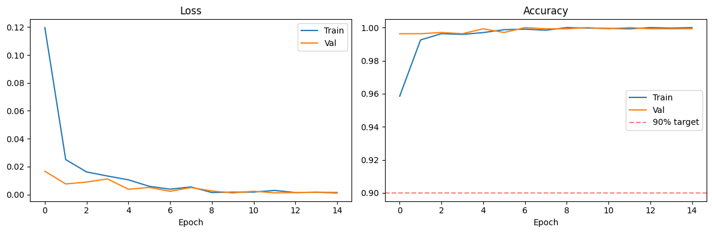

# Face Mask Detection Classifier

**Course:** Computer Vision — ITAI 1378  
**Framework:** PyTorch  
**Model:** ResNet-18 (fine-tuned)

---

## Problem Statement
During and after the COVID-19 pandemic, automated mask compliance monitoring became a real public health need. This project builds a classifier that determines whether a person is wearing a mask correctly, incorrectly, or not at all — from a face-centered photo.

## Solution
Fine-tuned a pretrained ResNet-18 (ImageNet weights) on a 3-class face mask dataset. The final classification layer was replaced and trained from scratch; the last residual block was unfrozen for fine-tuning. All earlier layers remained frozen to preserve general visual features and reduce training time.

**Pipeline:**  
`Input Image` → `Resize to 224×224` → `Normalize (ImageNet stats)` → `ResNet-18` → `Softmax` → `Class Prediction`

A post-prediction confidence threshold override is applied: if `mask_weared_incorrect` probability exceeds 20% while the top prediction is `with_mask`, the prediction is overridden. This corrects for a known dataset bias where nose-exposed mask wearing is underrepresented.

## Dataset
- **Source:** [vijaykumar1799/face-mask-detection](https://www.kaggle.com/datasets/vijaykumar1799/face-mask-detection) on Kaggle
- **Size:** 8,982 images (2,994 per class — perfectly balanced)
- **Classes:** `with_mask`, `without_mask`, `mask_weared_incorrect`
- **Format:** Pre-cropped face images organized in class folders (no bounding boxes)
- **Split:** 70% train / 15% val / 15% test

> Dataset is not included in this repository. Download via Kaggle using `kagglehub.dataset_download("vijaykumar1799/face-mask-detection")`.

## Preprocessing
- Resize to 224×224
- Normalize with ImageNet mean/std `([0.485, 0.456, 0.406], [0.229, 0.224, 0.225])`
- Training augmentation: random horizontal flip, color jitter (brightness/contrast ±0.3), random rotation ±10°

## Demo Video
[Watch Demo](https://drive.google.com/file/d/1RjsUOQ5Q7YVzrvl2_9rJRBHGZS6Q38Dt/view?usp=sharing)

## Results

| Metric | Value |
|---|---|
| Test Accuracy | 99.63% |
| Precision (macro avg) | ~99.6% |
| Recall (macro avg) | ~99.6% |
| Misclassifications | 5 / 1,347 |

### Confusion Matrix

### Training Curves

### Class Report Summary
- `mask_weared_incorrect`: 431/431 correct (100%)
- `with_mask`: 449/450 correct (99.8%)
- `without_mask`: 462/466 correct (99.1%)

## Key Findings

**What worked:**
- Transfer learning from ImageNet dramatically reduced required training data
- Dataset was perfectly balanced — no class weighting needed
- Converged within 2 epochs; val accuracy exceeded 99% from epoch 1

**Failure Cases (real-world testing):**

| Case | Result | Reason |
|---|---|---|
| Mask worn with nose exposed | Predicted `with_mask` (99.7% conf.) | Dataset underrepresents nose-exposure as "incorrect" |
| No mask, with headset + mic boom | Predicted `with_mask` | Mic boom resembles lower-face obstruction |
| Untight/wide-framed photo | Reduced confidence, potential misfire | Model expects face-centered crops like training data |

**Conclusion:** The model generalizes well within the training distribution but reveals three distinct out-of-distribution failure modes. All are traceable to dataset limitations rather than model architecture or training procedure.

## Technologies Used
- Python 3.x
- PyTorch, torchvision
- scikit-learn (metrics)
- matplotlib
- Google Colab (T4 GPU)
- kagglehub

## How to Run
Open the notebooks in order in Google Colab:

1. [`01_data_exploration.ipynb`](notebooks/01_data_exploration.ipynb)
2. [`02_model_training.ipynb`](notebooks/02_model_training.ipynb)
3. [`03_evaluation.ipynb`](notebooks/03_evaluation.ipynb)
4. [`04_demo.ipynb`](notebooks/04_demo.ipynb)

Each notebook installs its own dependencies. A Kaggle account is required to download the dataset.

## AI Usage
See [`docs/AI_usage_log.md`](docs/AI_usage_log.md) for full documentation of AI tools used in this project.
